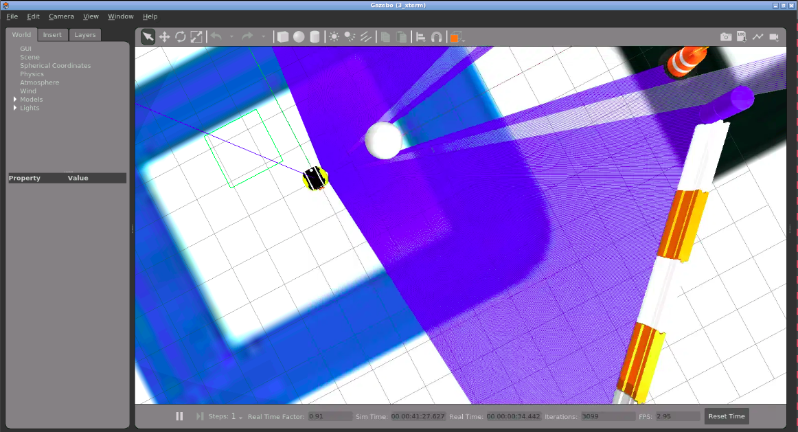

# CheckPoint 11 Robot PathPlanning

<a name="readme-top"></a>

## About The Project
The purpose of this project is to implement a Dijkstra algoritm for obstacle avoidance and path planning.



<!-- GETTING STARTED -->
## Getting Started

### Software Prerequisites
* Ubuntu 22.04
* ROS2 Galactic


<p align="right">(<a href="#readme-top">back to top</a>)</p>

<!-- INSTALLATION -->
### Installation
1. Clone the repo:
   ```sh
   cd ~ && \
   git clone https://github.com/pvela2017/The-Construct-CheckPoint-11-Robot-Path-Planning
   ```
2. Compile the simulation:
   ```sh
   source /opt/ros/galactic/setup.bash && \
   cd ~/The-Construct-CheckPoint-11-Robot-Path-Planning/ros2_ws && \
   colcon build
   ```
     
<p align="right">(<a href="#readme-top">back to top</a>)</p>


<!-- USAGE -->
## Usage
### Local Simulation & Real Robot
1. Launch the simulation:
   ```sh
   source /opt/ros/galactic/setup.bash && \
   source ~/The-Construct-CheckPoint-11-Robot-Path-Planning/ros2_ws/install/setup.bash && \
   ros2 launch neo_simulation2 simulation.launch.py
   ```
2. Launch the planner:
   ```sh
   source /opt/ros/galactic/setup.bash && \
   source ~/The-Construct-CheckPoint-11-Robot-Path-Planning/ros2_ws/install/setup.bash && \
   ros2 launch neo_nav2 neo_nav2_full.launch.xml
   ```
3. Launch moveit rviz interface:
   ```sh
   source /opt/ros/galactic/setup.bash && \
   source ~/The-Construct-CheckPoint-11-Robot-Path-Planning/ros2_ws/install/setup.bash && \
   ros2 launch my_moveit_config moveit_rviz.launch.py    # simulation
   ros2 launch real_moveit_config moveit_rviz.launch.py  # real
   ```
4. Pick and Place without perception:
   ```sh
   source /opt/ros/galactic/setup.bash && \
   source ~/The-Construct-CheckPoint-11-Robot-Path-Planning/ros2_ws/install/setup.bash && \
   ros2 launch moveit2_scripts pick_and_place_sim.launch.py    # simulation
   ros2 launch moveit2_scripts pick_and_place.launch.py        # real
   ```
6. Launch perception:
   ```sh
   source /opt/ros/galactic/setup.bash && \
   source ~/The-Construct-CheckPoint-11-Robot-Path-Planning/ros2_ws/install/setup.bash && \
   ros2 launch get_cube_pose get_pose_client.launch.py    # simulation
   ```   
7. Pick and Place with perception:
   ```sh
   source /opt/ros/galactic/setup.bash && \
   source ~/The-Construct-CheckPoint-11-Robot-Path-Planning/ros2_ws/install/setup.bash && \
   ros2 launch moveit2_scripts pick_and_place_perception_sim.launch.py    # simulation
   ros2 launch moveit2_scripts pick_and_place_perception.launch.py        # real
   ```

<p align="right">(<a href="#readme-top">back to top</a>)</p>


<!-- KEYS -->
## Key topics learnt
* ROS2 custom planners.